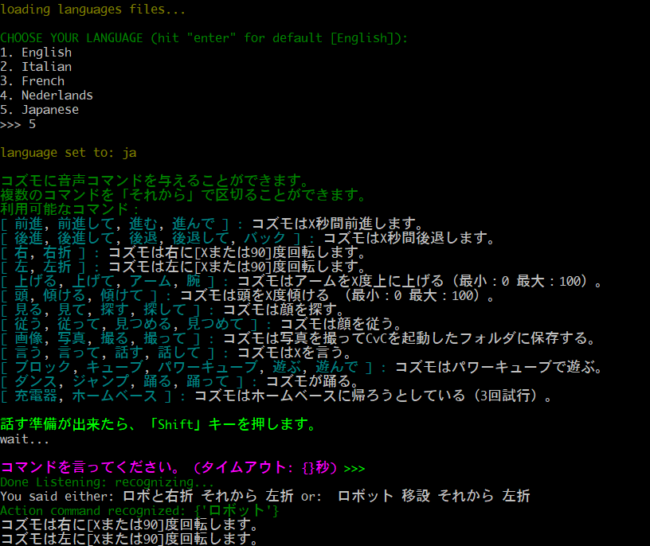

A small modification of [Cozmo voice Commands (CvC)](https://github.com/rizal72/Cozmo-Voice-Commands) to include Japanese speech recognition and tweak the interface, by making use of Yukino Ikegami's Python [port](https://pypi.python.org/pypi/rakutenma) of Masato Hagiwara's [RakutenMA](https://github.com/rakuten-nlp/rakutenma); the port is included in this repository.

Initial testing suggests Python 3.6+ is necessary for proper Unicode handling with respect to default encodings and for Windows 10, you'll want to use a Unicode-savvy terminal font such as Osaka Unicode.

This screenshot shows the use of a chain of commands to turn right and left with the default arguments (90 degrees).
